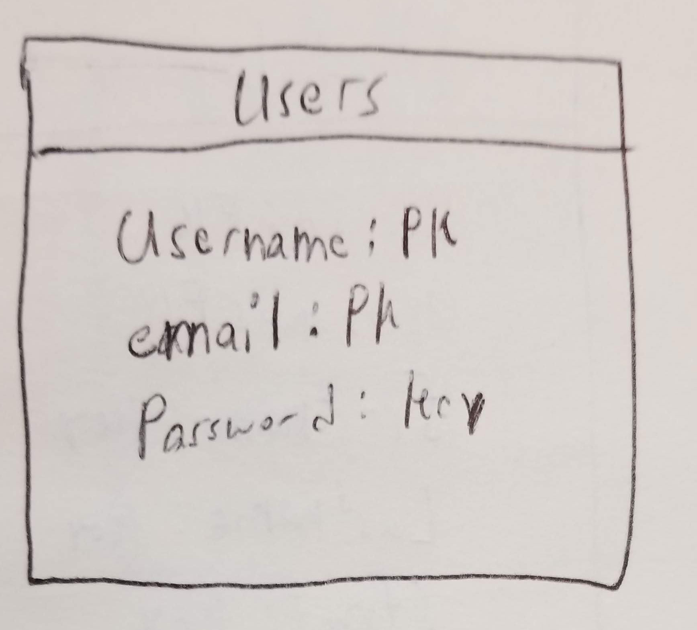
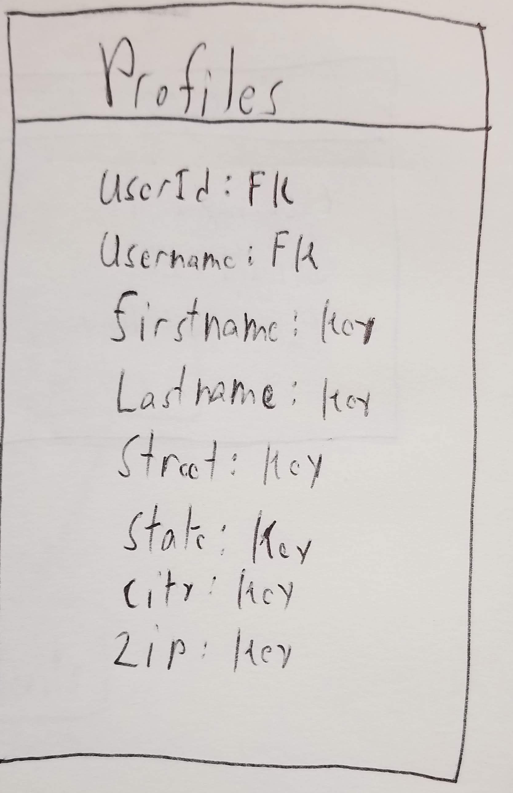
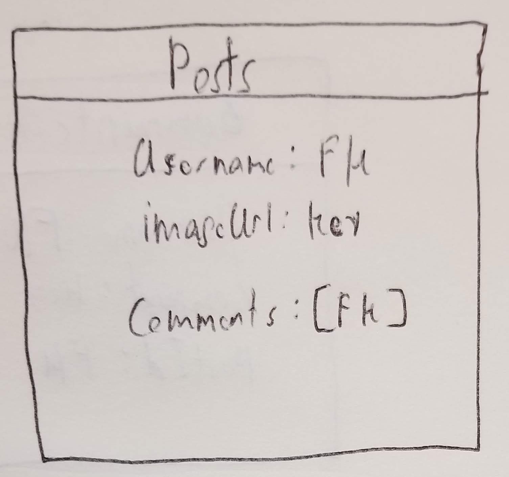
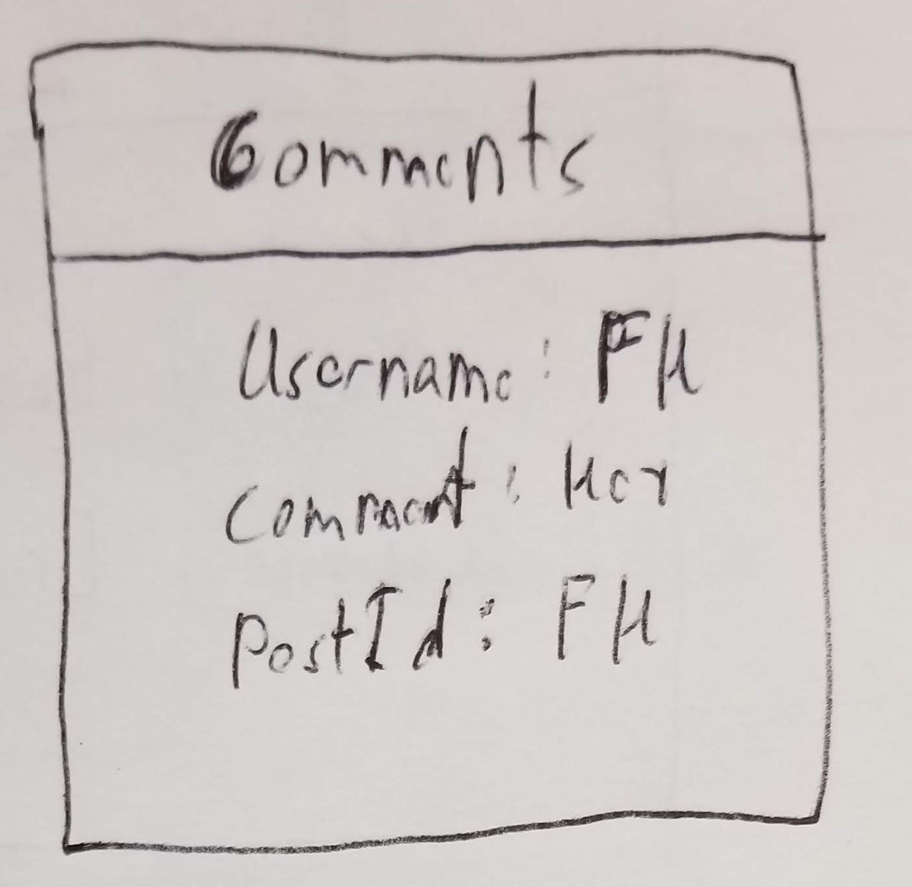

# Imgy-API Documentaion

Documentaion of my first API using express. Justs going to detail the all the routes and their responses for my reference. 

## User Endpoints

All Endpoint for User

* [Get all Users](docs/getAllUsers.md) : `GET /api/users`
* [Get User by username](docs/getUsersByUsername.md) : `GET /api/users/:username`
* [Get User by id](docs/getUsersByID.md) : `GET /api/users/id/:id`
* [Create new User](docs/createUser.md) : `POST /api/users`
* [Remove a User](docs/users.js) : `DELETE /api/users`

## Profile Endpoints

All Endpoint for Profile

* [Get all Profiles](docs/users.js) : `GET /api/profiles`
* [Get Profile by username](docs/users.js) : `GET /api/profiles/:username`
* [Create new Profile](docs/users.js) : `POST /api/profiles`
* [Update a Profile](docs/users.js) : `PUT /api/profiles`
* [Remove a Profile](docs/users.js) : `DELETE /api/profiles`

## Post Endpoints

All Endpoint for Post

* [Get all Posts](docs/users.js) : `GET /api/posts`
* [Get all Posts with a specific username](docs/users.js) : `GET /api/posts/:username`
* [Get a Post using an id](docs/users.js) : `GET /api/posts/id/:id`
* [Create a Post](docs/users.js) : `POST /api/posts/:username`
* [Delete a Post](docs/users.js) : `DELETE /api/posts/:id`

## Comment Endpoints

All Endpoint for Comment

* [Get all Comments](docs/users.js) : `GET /api/comments`
* [Get a Comment with id](docs/users.js) : `GET /api/comments/:id`
* [Get all Comments with a username](docs/users.js) : `GET /api/comments/username/:id`
* [Create a new Comment](docs/users.js) : `POST /api/comments/:postId`
* [Delete a Comment](docs/users.js) : `DELEte /api/comments/:id`

## Auth Endpoint

EndPoint for Authorization
* [Login](docs/login.md) : `POST /api/auth/login`

## ER Diagram and Schema

### ER Diagram

    Showing the relation with each collection in the database.

    

### Schemas

    All the contents of each collection in the database.

    
    
    
    

